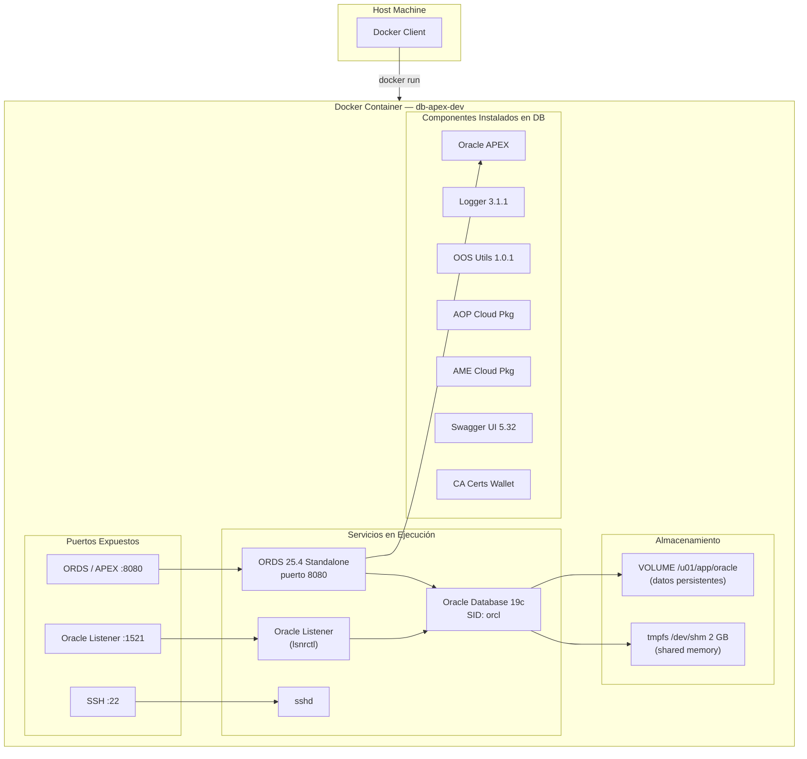
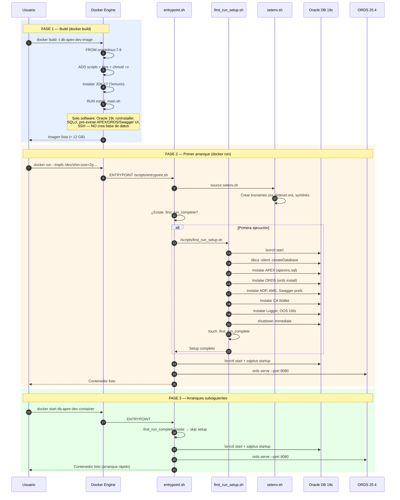

# Oracle Database 19c & APEX Developer Docker Image

## Contenido

| Componente | Versión |
|---|---|
| Oracle Linux | 7.9 |
| Oracle Database | 19.3 Enterprise Edition (non-CDB) |
| Oracle APEX | Latest |
| Oracle ORDS | 25.4.2 (standalone) |
| Oracle SQLcl | Latest |
| Eclipse Temurin OpenJDK | 17.0.18+8 |
| gosu | 1.14 |
| OraOpenSource Logger | 3.1.1 |
| OraOpenSource OOS Utils | 1.0.1 |
| APEX Office Print (AOP) | Cloud Package |
| APEX Media Extension (AME) | Cloud Package |
| Swagger UI | 5.32.0 |

---

## Arquitectura del Proyecto



---

## Diagrama de Secuencia — Ciclo de Vida del Contenedor



---

## Datos de Conexión y Endpoints

### Oracle Database

| Parámetro | Valor |
|---|---|
| **Host** | `localhost` |
| **Puerto** | `1521` |
| **SID** | `orcl` |
| **Service Name** | `orcl` |
| **JDBC URL** | `jdbc:oracle:thin:@//localhost:1521/orcl` |
| **TNS Connect String** | `(DESCRIPTION=(ADDRESS=(PROTOCOL=TCP)(HOST=localhost)(PORT=1521))(CONNECT_DATA=(SERVICE_NAME=orcl)))` |
| **Usuario SYS** | `sys` / `oracle` (as SYSDBA) |
| **Usuario SYSTEM** | `system` / `oracle` |

### Oracle APEX

| Parámetro | Valor |
|---|---|
| **URL de acceso** | `http://localhost:8080/ords/apex` |
| **Workspace** | `INTERNAL` |
| **Usuario Admin** | `ADMIN` |
| **Contraseña Admin** | `OrclAPEX1999!` |
| **APEX Images** | Servidas por ORDS desde `${ORACLE_HOME}/apex/images` |

### Oracle ORDS (REST Services)

| Parámetro | Valor |
|---|---|
| **URL base** | `http://localhost:8080/ords/` |
| **Modo** | Standalone (puerto 8080) |
| **Home** | `/u01/ords` |
| **Config** | `/u01/ords/config` |

### SQL Developer Web

| Parámetro | Valor |
|---|---|
| **URL** | `http://localhost:8080/ords/sql-developer` |
| **Habilitado** | Si `INSTALL_SQLDEVWEB=true` |

### Swagger UI

| Parámetro | Valor |
|---|---|
| **URL** | `http://localhost:8080/ords/open-api-catalog/` |
| **Archivos estáticos** | `/opt/swagger-ui/` |

### SSH

| Parámetro | Valor |
|---|---|
| **Puerto** | `22` |
| **Usuario** | `oracle` |
| **Contraseña** | `oracle` (valor de `PASS`) |

### SQLcl

| Parámetro | Valor |
|---|---|
| **Ruta** | `/opt/sqlcl/bin/sql` |
| **Ejemplo de conexión** | `sql sys/oracle@localhost:1521/orcl as sysdba` |

---

## Instalación

### 1. Clonar el repositorio

```bash
git clone https://github.com/garzontaleroj/docker-db-apex-dev.git
cd docker-db-apex-dev
```

### 2. Descargar Software Requerido

Descargue los archivos de instalación manualmente (requiere aceptar las licencias de Oracle) y colóquelos en el directorio `files/`:

| Archivo | Descripción |
|---|---|
| `LINUX.X64_193000_db_home.zip` | Oracle Database 19c EE |
| `apex_*.zip` | Oracle APEX |
| `ords-*.zip` | Oracle ORDS 25.4 |
| `sqlcl-*.zip` | Oracle SQLcl |
| `OpenJDK17U-jdk_x64_linux_hotspot_17.0.18_8.tar.gz` | Eclipse Temurin JDK 17 |
| `logger_3.1.1.zip` | OraOpenSource Logger |
| `oos-utils-latest.zip` | OraOpenSource OOS Utils |
| `swagger-ui-*.zip` | Swagger UI |
| `aop_*.zip` | APEX Office Print (opcional) |
| `ame_*.zip` | APEX Media Extension (opcional) |

### 3. Personalizar Variables de Entorno (opcional)

Edite las variables de entorno en el [Dockerfile](Dockerfile):

```bash
INSTALL_APEX=true              # Instalar Oracle APEX + ORDS
INSTALL_SQLCL=true             # Instalar Oracle SQLcl
INSTALL_SQLDEVWEB=true         # Habilitar SQL Developer Web (ORDS >= 19.4)
INSTALL_LOGGER=true            # Instalar OraOpenSource Logger
INSTALL_OOSUTILS=true          # Instalar OraOpenSource OOS Utils
INSTALL_AOP=true               # Instalar APEX Office Print
INSTALL_AME=true               # Instalar APEX Media Extension
INSTALL_SWAGGER=true           # Instalar Swagger UI
INSTALL_CA_CERTS_WALLET=true   # Instalar CA Root Certificates Wallet
DBCA_TOTAL_MEMORY=2048         # Memoria para la base de datos (MB)
ORACLE_SID=orcl                # SID de la base de datos
SERVICE_NAME=orcl              # Service Name de la base de datos
DB_INSTALL_VERSION=19          # Versión de Oracle DB (12, 18 o 19)
PASS=oracle                    # Contraseña para SYS, SYSTEM, SSH, etc.
APEX_PASS=OrclAPEX1999!        # Contraseña del admin APEX
TIME_ZONE=UTC                  # Zona horaria (e.g. America/Bogota)
```

### 4. Construir la Imagen Docker

```bash
docker build -t db-apex-dev-image .
```

> **Nota:** Asegúrese de tener al menos 40-50 GB de espacio libre en disco. La imagen resultante pesa ~15-16 GB.

### 5. Ejecutar el Contenedor

```bash
docker run -dit --name db-apex-dev-container \
  -p 8080:8080 -p 1521:1521 -p 2222:22 \
  -v /dev/shm --tmpfs /dev/shm:rw,nosuid,nodev,exec,size=2g \
  db-apex-dev-image
```

> **Importante:** El `tmpfs` de `/dev/shm` con al menos 2 GB es **obligatorio** para que `dbca` pueda crear la base de datos.

En el **primer arranque**, el contenedor ejecutará `first_run_setup.sh` automáticamente:
- Crea la base de datos Oracle (`dbca`)
- Instala APEX, ORDS, AOP, AME, Swagger, CA Wallet, Logger, OOS Utils
- Escribe el marcador `.first_run_complete`
- Los arranques posteriores son rápidos (solo inicia servicios)

### 6. Iniciar / Detener el Contenedor

```bash
docker start db-apex-dev-container
docker stop db-apex-dev-container
```

---

## Usuarios de Base de Datos

| Usuario | Contraseña | Descripción |
|---|---|---|
| `SYS` | `oracle` | DBA (connect as SYSDBA) |
| `SYSTEM` | `oracle` | DBA |
| `APEX_LISTENER` | `oracle` | ORDS listener |
| `APEX_REST_PUBLIC_USER` | `oracle` | ORDS REST público |
| `APEX_PUBLIC_USER` | `oracle` | APEX público |
| `LOGGER_USER` | `oracle` | OraOpenSource Logger |
| `OOSUTILS_USER` | `oracle` | OraOpenSource OOS Utils |
| `AOP` | `oracle` | APEX Office Print |
| `AME` | `oracle` | APEX Media Extension |
| `SDW_ADMIN` | `oracle` | SQL Developer Web |

Cadena de conexión rápida: `system/oracle@localhost/orcl`

---

## Estructura del Proyecto

```
docker-db-apex-dev/
├── Dockerfile                          # Define la imagen Docker
├── README.md                           # Este archivo
├── files/
│   ├── db_install_19.rsp               # Response file para Oracle 19c
│   ├── ords_params.properties          # Parámetros ORDS
│   ├── tomcat-users.xml                # (legacy)
│   ├── tomcat.service                  # (legacy)
│   ├── download_urls.txt               # URLs de descarga de software
│   └── *.zip / *.tar.gz               # Archivos de instalación (no en repo)
└── scripts/
    ├── install_main.sh                 # Orquestador build-time (solo software)
    ├── first_run_setup.sh              # Orquestador run-time (DB + componentes)
    ├── entrypoint.sh                   # Punto de entrada del contenedor
    ├── setenv.sh                       # Configuración de entorno Oracle
    ├── install_oracle19ee.sh           # Instalación software Oracle 19c
    ├── install_apex.sh                 # Instalación APEX en DB
    ├── install_ords.sh                 # Instalación/configuración ORDS
    ├── install_java.sh                 # Instalación JDK
    ├── install_sqlcl.sh                # Instalación SQLcl
    ├── install_logger.sh               # Instalación Logger
    ├── install_oosutils.sh             # Instalación OOS Utils
    ├── install_aop.sh                  # Instalación AOP
    ├── install_ame.sh                  # Instalación AME
    ├── install_swagger.sh              # Configuración Swagger UI
    ├── install_ca_wallet.sh            # CA Certificates Wallet
    ├── install_ssh.sh                  # Configuración SSH
    ├── image_setup.sh                  # Setup base de imagen
    ├── validations.sh                  # Validaciones pre-instalación
    └── create_container_test.sh        # Script de prueba rápida
```

---

## Cambios Realizados vs. Proyecto Original

### 1. Arquitectura de Dos Fases (Build / Run)

**Problema:** El proyecto original ejecutaba `dbca` (creación de base de datos) durante `docker build`. Esto fallaba silenciosamente porque Docker limita `/dev/shm` a 64 MB durante el build, pero Oracle requiere al menos 2 GB de shared memory.

**Solución:** Se separó el proceso en dos fases:

| Fase | Momento | Script | Operaciones |
|---|---|---|---|
| **Build** | `docker build` | `install_main.sh` | Instala software Oracle (runInstaller), JDK, SQLcl, SSH. Pre-extrae APEX, ORDS y Swagger UI. **No toca la base de datos.** |
| **Run** | Primer `docker run` | `first_run_setup.sh` | Crea la DB con `dbca`, instala APEX, configura ORDS, instala todos los componentes DB-dependent. Escribe marcador `.first_run_complete`. |

**Archivos modificados:**
- `install_main.sh` — Eliminadas todas las llamadas a componentes que dependen de la DB
- `install_oracle19ee.sh` — Eliminados `dbca`, configuración de listener y política de passwords
- `entrypoint.sh` — Añadida detección de primer arranque

**Archivos creados:**
- `first_run_setup.sh` — Nuevo orquestador de primer arranque

### 2. Actualización de Componentes

| Componente | Antes | Después |
|---|---|---|
| JDK | AdoptOpenJDK 11.0.9.1 | Eclipse Temurin 17.0.18 |
| ORDS | 20.3 (Tomcat) | 25.4.2 (Standalone) |
| gosu | 1.12 | 1.14 |
| Swagger UI | 3.35.2 | 5.32.0 |
| Tomcat | 8.5.60 | **Eliminado** (ORDS standalone) |

### 3. ORDS Standalone (Sin Tomcat)

ORDS 25.4 se ejecuta en modo standalone con su servidor web integrado, eliminando la dependencia de Apache Tomcat:

```bash
# Antes (ORDS 20.x + Tomcat)
${TOMCAT_HOME}/bin/catalina.sh start

# Ahora (ORDS 25.4 standalone)
${ORDS_HOME}/bin/ords --config ${ORDS_CONFIG} serve --port 8080 --apex-images ${ORACLE_HOME}/apex/images
```

### 4. Corrección de Permisos de Scripts

Se añadió `RUN chmod +x /scripts/*.sh` en el Dockerfile después de las instrucciones `ADD`, ya que los scripts perdían el bit de ejecución al copiarlos.

### 5. Corrección de Rutas Relativas

Todas las rutas relativas (`./scripts/...`) en `install_main.sh` se convirtieron a rutas absolutas (`/scripts/...`) para evitar errores cuando el working directory cambia durante la extracción de archivos.

### 6. Descarga de gosu en Build

gosu se descarga directamente en el Dockerfile con `wget` en lugar de depender de un archivo pre-descargado, simplificando la preparación.

---

## Troubleshooting

### El contenedor falla con ORA-01034 o initorcl.ora no encontrado

Asegúrese de que el contenedor se ejecuta con suficiente shared memory:
```bash
docker run ... --tmpfs /dev/shm:rw,nosuid,nodev,exec,size=2g ...
```

### El primer arranque tarda mucho

Es normal. La creación de la base de datos con `dbca` y la instalación de todos los componentes puede tomar 15-30 minutos dependiendo del hardware. Monitoree con:
```bash
docker logs -f db-apex-dev-container
```

### Cómo reconstruir la imagen desde cero

```bash
docker rm -f db-apex-dev-container
docker rmi db-apex-dev-image
docker build -t db-apex-dev-image .
```

### Cómo forzar re-ejecución del first_run_setup

```bash
docker exec db-apex-dev-container rm /u01/app/oracle/.first_run_complete
docker restart db-apex-dev-container
```

---

## Créditos

Este Dockerfile está basado en el trabajo de:

- Philipp Salvisberg — [PhilippSalvisberg/docker-oracle12ee](https://github.com/PhilippSalvisberg/docker-oracle12ee)
- Andrzej Raczkowski — [araczkowski/docker-oracle-apex-ords](https://github.com/araczkowski/docker-oracle-apex-ords)
- Daniel Hochleitner — [Dani3lSun/docker-db-apex-dev](https://github.com/Dani3lSun/docker-db-apex-dev)

## Licencia

MIT

Consulte el [Oracle Database Licensing Information User Manual](https://docs.oracle.com/database/122/DBLIC/Licensing-Information.htm#DBLIC-GUID-B6113390-9586-46D7-9008-DCC9EDA45AB4) respecto a las licencias de Oracle Database.
